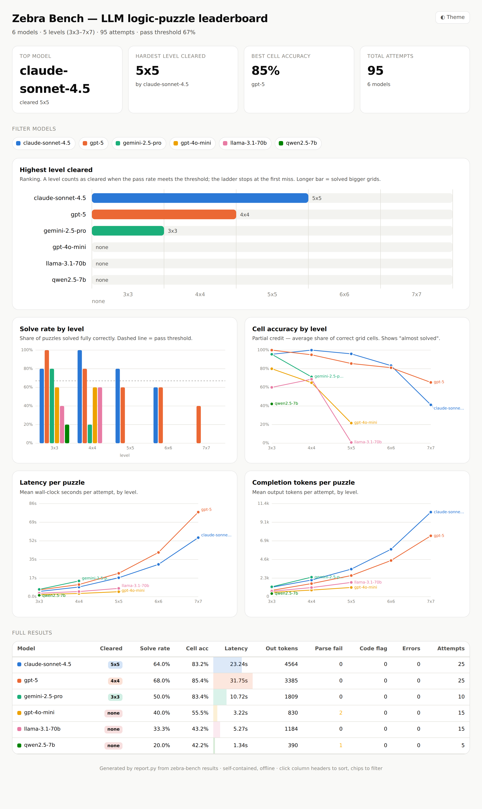
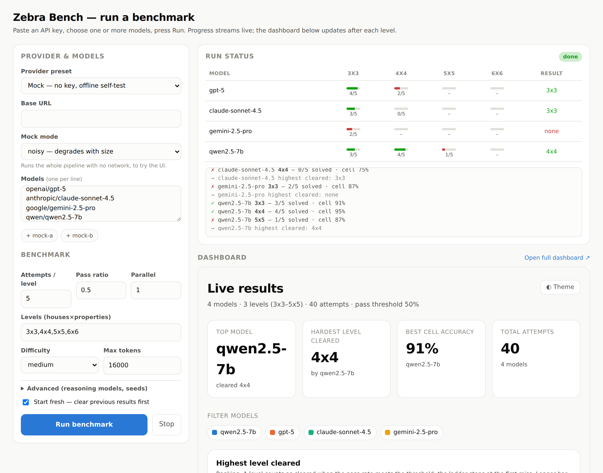

# Zebra Bench — бенчмарк логічного міркування для LLM

Генерує зебра-пазли з гарантовано унікальним розв'язком і піднімає модель по драбині
складності: **3×3 → 4×4 → 5×5 → 6×6 → 7×7** (будинки × властивості).
Кожен пазл надсилається у **чистому контексті** (без історії, без прикладів).
У промпті прямо заборонено писати або виконувати код — модель має міркувати сама.



> Інтерактивний дашборд (`report.py`): лідерборд, solve-rate і cell-accuracy за рівнем,
> латентність/токени, підказки при наведенні, фільтр моделей, світла/темна тема.
> *(на скріншоті — синтетичні дані для прев'ю)*

## Файли

| файл | що робить |
|---|---|
| `zebra.py` | генератор + solver (порт `zebra-puzzle.html`, той самий PRNG → **сіди сумісні з HTML-сторінкою**), промпт, парсер і оцінювання |
| `bench.py` | прогін бенчмарку через будь-який OpenAI-сумісний `/chat/completions` (CLI) |
| `serve.py` | **локальний веб-UI**: вставити ключ, вибрати моделі, натиснути Run |
| `report.py` | **інтерактивний HTML-дашборд** (один самодостатній файл, без CDN) |
| `plots.py` | статичні PNG-графіки + `summary.csv` |
| `make_sample.py` | синтетичні дані для прев'ю дашборда (не справжній прогін) |

Залежності: **`serve.py`, `report.py`, `bench.py` — чистий stdlib** (нічого ставити не
треба). Лише `plots.py` потребує `matplotlib`.

## Запуск через веб-UI (найпростіше)

```bash
python serve.py            # відкрити http://127.0.0.1:8000
```

У браузері: вибрати провайдера (OpenAI / OpenRouter / локальний / **mock без ключа**),
вставити API-ключ, вписати одну або кілька моделей, натиснути **Run benchmark**.
Прогрес іде наживо (по кожній спробі), а дашборд знизу оновлюється після кожного рівня.



- Ключ надсилається **лише на цей локальний процес**, тримається в пам'яті на час
  прогону і **не пишеться на диск**. Сервер слухає тільки `127.0.0.1`.
- LLM-виклики робить сам сервер (Python), тож немає проблем з CORS і ключ не
  світиться у сторінці.
- Кнопка **Stop** зупиняє прогін; **Start fresh** очищає попередні результати.
- Результати дописуються у `results.jsonl` — той самий файл, що й у CLI.

Щоб спробувати UI без ключа й без мережі — виберіть провайдера **Mock**.

## Запуск через CLI

```bash
pip install matplotlib   # лише якщо потрібні PNG від plots.py

# подивитися промпт 3x3 і правильну відповідь
python bench.py --dry-run --levels 3x3

# перевірити пайплайн без API (mock-модель розв'язує сама)
python bench.py --mock perfect
python bench.py --mock noisy --model noisy-a --model noisy-b --attempts 4

# справжній прогін
export OPENAI_API_KEY=sk-...
python bench.py --model gpt-4o-mini --attempts 3

# OpenRouter / локальні моделі / кілька моделей одразу
python bench.py \
  --base-url https://openrouter.ai/api/v1 --api-key-env OPENROUTER_API_KEY \
  --model anthropic/claude-sonnet-4.5 --model openai/gpt-5 \
  --attempts 5 --parallel 3

python plots.py results.jsonl
```

Для reasoning-моделей OpenAI: `--tokens-param max_completion_tokens --no-temperature`.

## Основні параметри `bench.py`

- `--attempts N` — скільки різних пазлів на рівень (за замовчуванням 3)
- `--pass-ratio 0.67` — частка повністю правильних, щоб рівень зарахувався; на першому провалі драбина зупиняється
- `--levels 3x3,4x4,5x5` — власна драбина
- `--difficulty easy|medium|hard` — щедрість підказок при генерації
- `--seed` — база для сідів: **однакові сіди = однакові пазли для всіх моделей**
- `--save-replies` — зберігати повні відповіді у JSONL
- `--parallel N`, `--sleep`, `--timeout`, `--max-tokens`

## Як оцінюється відповідь

Модель має завершити відповідь одним JSON:

```json
{"grid": {"Color": ["Red", "..."], "Nationality": ["..."]}, "answer": "Swede"}
```

- `correct` = **вся сітка правильна І відповідь на питання правильна** (це і є pass/fail)
- `cell_acc` = частка правильних клітинок (часткові бали, показує «майже розв'язав»)
- `answer_correct` — окремо, щоб бачити вгадування
- `code_flag` — евристика: у відповіді видно код/скрипт (порушення правил)
- `parsed` = false — модель не видала валідний JSON

Порівняння регістру й пробілів нормалізоване, порядок ключів не важливий.

## Результати

`results.jsonl` — по рядку на спробу (модель, рівень, сід, оцінки, латентність, токени).

### Інтерактивний дашборд (рекомендовано)

```bash
python report.py results.jsonl --open      # -> charts/report.html
```

Один самодостатній HTML-файл (без залежностей, без мережі — працює офлайн):

- **лідерборд** — найвищий пройдений рівень на модель, з рангуванням;
- **solve rate** і **cell accuracy** за рівнем, з підказками при наведенні;
- **латентність** і **токени** за рівнем;
- **повна таблиця** з сортуванням по кліку;
- фільтр моделей (чіпи), світла/темна тема.

Палітра — colorblind-safe; при наведенні на будь-яку точку/стовпчик видно точні числа.

Щоб подивитись, який вигляд має дашборд із «справжніми» моделями, згенеруйте
синтетичне прев'ю:

```bash
python make_sample.py                       # -> sample_results.jsonl (вигадані числа!)
python report.py sample_results.jsonl --open
```

### Статичні PNG

```bash
python plots.py results.jsonl               # -> charts/*.png + summary.csv
```

1. `01_pass_rate.png` — частка розв'язаних за рівнем
2. `02_cell_accuracy.png` — часткові бали за рівнем
3. `03_max_level.png` — найвищий пройдений рівень на модель
4. `04_cost.png` — латентність і токени за рівнем
5. `summary.csv` — ті самі числа таблицею

> `results.jsonl` і `charts/`, що вже лежать у папці, — це демо з `--mock` прогону
> (перевірка пайплайну). Видаліть їх перед справжнім запуском, бо `bench.py` дописує в кінець файлу.
> `sample_results.jsonl` — **синтетичні** числа лише для прев'ю UI, не результат прогону.

## Дрібниці

- Сід кожного пазла (`5h4p-m-b50737b4`) можна вставити в `zebra-puzzle.html` → «Load seed» і зіграти той самий пазл руками або показати розв'язок.
- Складність 7×7×7 — це 7 будинків і 7 властивостей: 42 клітинки, ~35–47 підказок; більшість моделей падає раніше.
- Заборона коду перевіряється лише евристикою в тексті відповіді — якщо у вашого провайдера увімкнено tool use / code interpreter, вимкніть його на рівні API.
